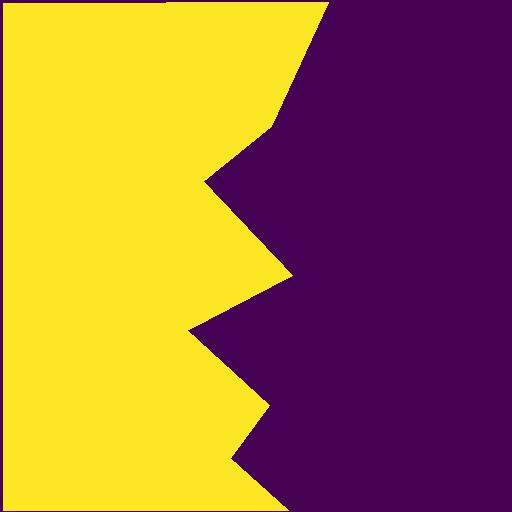
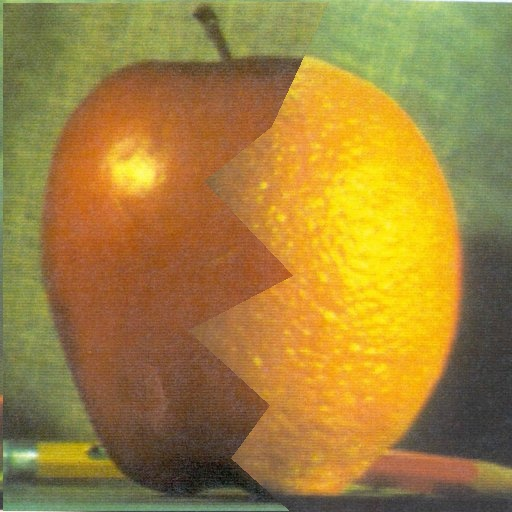
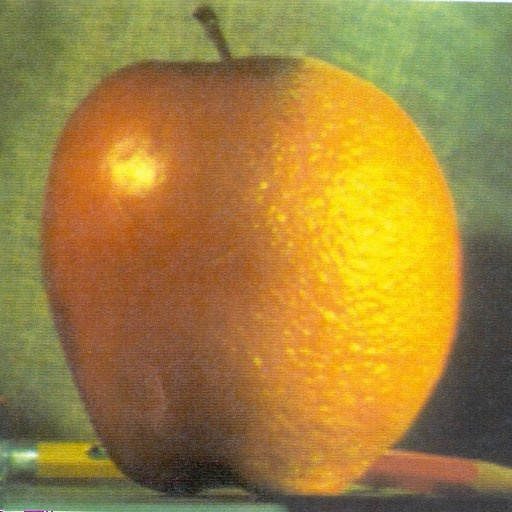
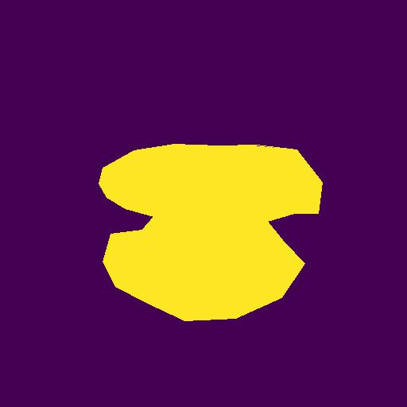
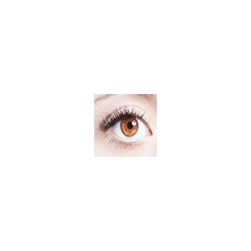
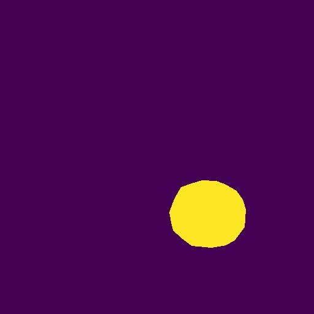
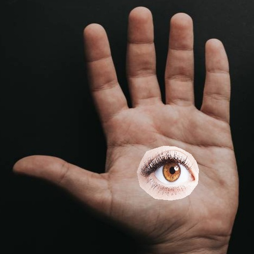
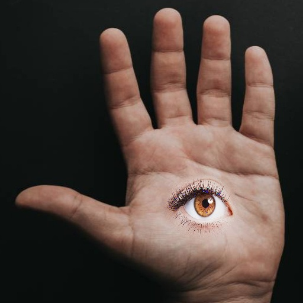

## Project Definition

In this project, with the help of **Feathering with Laplacian Pyramid**, **Source** and **Target** images are blended in different 
frequencies. 

At low frequencies, Feathering is done strongly and intensely and at high
frequencies, Feathering is done poorly. In this way, images are blended, but **the details of each part of each image will remain.**

## Results

| Source | Target | Mask | Direct Merge Result | Pyramid Blending Result
| ------ | ------ | ------ | ----- | -------- |
|  |  |  |  |  |
|  |  |  |  |  |
|  |  |  |  |  |